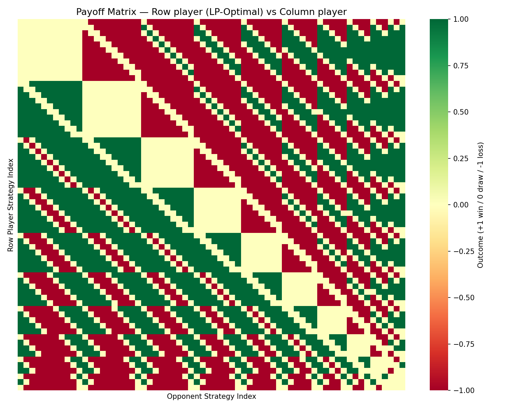
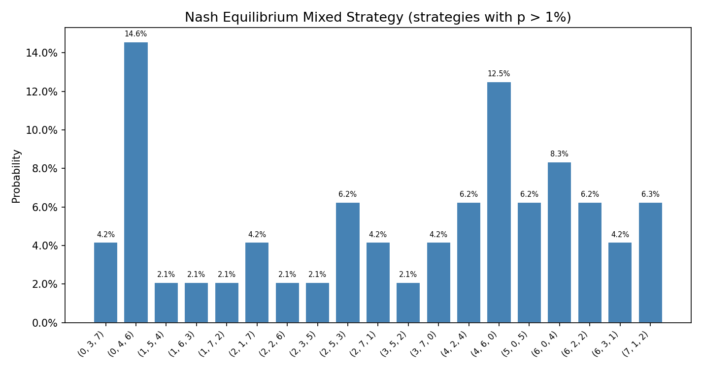
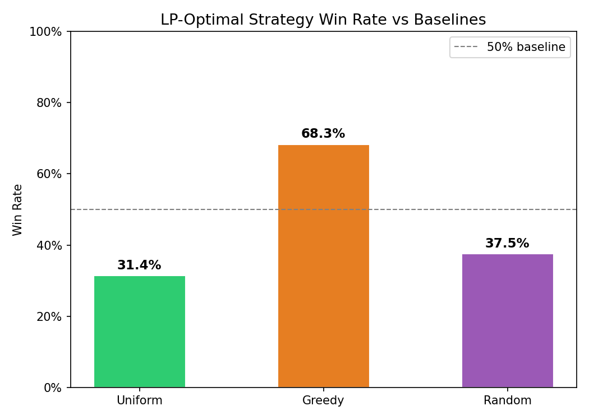

# Blotto Solver — Mixed-Strategy Nash Equilibrium via LP

Colonel Blotto is a two-player zero-sum game where each player simultaneously distributes N troops across K battlefields. A player wins a battlefield if they send strictly more troops there; whoever wins more battlefields wins the game. Because both players choose simultaneously with no information about the opponent, the optimal strategy is a *mixed strategy* — a probability distribution over allocations rather than any single fixed deployment.

## How the LP Solver Works

The Nash equilibrium is found by solving a minimax linear program. The row player wants to maximize their guaranteed minimum expected payoff `v` regardless of what the opponent does:

```
Maximize  v
Subject to:
  For each opponent strategy j:  Σ_i p_i · M[i,j] ≥ v
  Σ_i p_i = 1
  p_i ≥ 0
```

Where `M` is the payoff matrix (`M[i,j] = +1` if strategy i beats j, `-1` if it loses, `0` if tied) and `p` is the mixed strategy probability vector. This is rewritten as a minimization problem for `scipy.optimize.linprog` (HiGHS solver). The game value `v ≈ 0` confirms the game is perfectly symmetric.

## Setup

```bash
pip install numpy scipy matplotlib seaborn
```

## Usage

```bash
# Default: 10 troops, 3 fields
python main.py

# Custom parameters
python main.py --troops 10 --fields 4 --games 10000

# Skip plots
python main.py --no-plot
```

## Example Output (10 troops, 3 fields)

**66 strategies** in the strategy space. The Nash equilibrium mixes over 15 strategies — most weight on asymmetric allocations that are hard to counter:

```
Top strategies in Nash equilibrium mixed strategy:
  # 1  (0, 4, 6)    p = 0.1458
  # 2  (4, 6, 0)    p = 0.1250
  # 3  (6, 0, 4)    p = 0.0833
  # 4  (7, 1, 2)    p = 0.0625
  ...
```

**Benchmark Results (10,000 simulated games):**

```
LP-Optimal vs Uniform   W: 3136   L: 3084   D: 3780   Win rate: 31.4%  Score: 50.3%
LP-Optimal vs Greedy    W: 6831   L: 0      D: 3169   Win rate: 68.3%  Score: 84.2%
LP-Optimal vs Random    W: 3754   L: 2986   D: 3260   Win rate: 37.5%  Score: 53.8%
```

*Score = (W + 0.5·D) / N, the standard game-theoretic expected value treating draws as 0.5.*

The high draw rate vs Uniform reflects the game's symmetric structure: Uniform plays a single fixed allocation that many LP strategies tie against. The LP strategy *never loses* to Greedy (68.3% wins, 31.7% draws) — a consequence of the Nash equilibrium dominating the pure-strategy "put everything on field 1" approach.

## Visualizations

| Payoff Matrix | Mixed Strategy | Win Rates |
|---|---|---|
|  |  |  |

## Computational Complexity

The strategy space grows combinatorially: `C(N+K-1, K-1)` allocations total.

| Troops | Fields | Strategies | Payoff Matrix |
|--------|--------|------------|---------------|
| 10 | 3 | 66 | 66×66 |
| 10 | 4 | 286 | 286×286 |
| 10 | 5 | 1001 | 1001×1001 |
| 20 | 5 | 10626 | 10626×10626 |

The LP scales as O(n³) with strategy count. For (10, 5) it takes ~30s; beyond that, approximate methods (column generation, support enumeration) are needed.

## File Structure

```
blotto.py      — strategy enumeration, payoff computation, matrix builder
solver.py      — minimax LP via scipy linprog (HiGHS)
benchmark.py   — 10,000-game simulation vs uniform / greedy / random
visualize.py   — payoff heatmap, strategy bar chart, win-rate comparison
main.py        — CLI entry point
```
